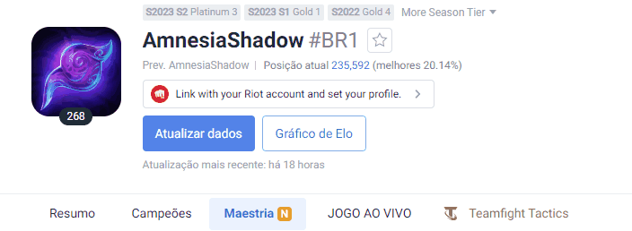

# Projeto com README
Um projeto de teste com um arquivo README 🚀

[](https://www.op.gg/summoners/br/AmnesiaShadow-BR1)

## Tecnologias utilizadas
- HTML
- CSS
- JS

## Como utilizar

1 - Clone pro projeto
```
git clone <url>
```

2 - Acesse a pasta do projeto
```
cd repositorio-com-readme
```